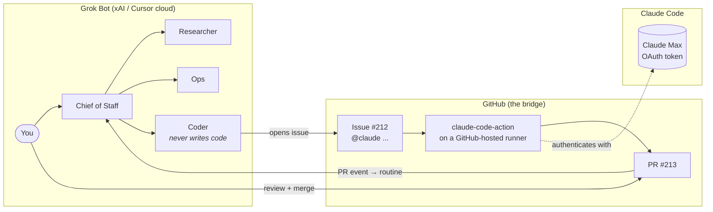

# grokbot-claude-bridge

**Run Grok Bot as your command centre. Run every line of code on Claude Code, billed to your Claude subscription. Use GitHub as the bridge. No servers.**

> Status: design complete, implementation starting. See [TASKS.md](TASKS.md).

## The problem in one sentence

Grok Bot bills coding on an unpublished weekly meter with no model choice, no spend cap and silent spillover into paid overage. Claude Max bills coding at a flat rate on a model you choose. This project moves exactly one category of work — code — across that billing boundary, and nothing else.

## How it works



1. You ask the Chief of Staff for something that needs engineering.
2. It delegates to the **Coder** bot, whose only job is to open a GitHub issue with `@claude` and a clear brief.
3. The official [Claude Code GitHub Action](https://code.claude.com/docs/en/github-actions) runs on a GitHub-hosted runner, authenticated with your **Claude subscription OAuth token** — not an API key.
4. Claude Code reads the issue, edits, runs tests, opens a PR.
5. A Grok Bot **routine** catches the PR event and the Chief of Staff tells you it's ready.
6. You review and merge. **The PR is the approval.**

## What you get

| | |
|---|---|
| Servers to run | **0** |
| Meters Grok Bot pays for | coordination only |
| Meters Claude Max pays for | all code |
| Approval gate | the pull request |
| Prompt-injection defence | only accounts with repo write access can trigger Claude |
| Time to first PR | ~2 hours |

## Quick start

See [docs/03-setup-guide.md](docs/03-setup-guide.md). Short version:

```bash
# 1. In the repo you want Claude to work on
gh secret set CLAUDE_CODE_OAUTH_TOKEN --body "$(claude setup-token)"
cp templates/claude.yml .github/workflows/claude.yml
cp templates/CLAUDE.md.template CLAUDE.md
# 2. Open an issue containing "@claude" from your own account. Get a PR back.
# 3. Only then: create the Coder bot in Grok Bot from templates/bots/coder.md
```

## Documentation

| Doc | What it answers |
|---|---|
| [00-overview](docs/00-overview.md) | Why this exists, what it is not |
| [01-architecture](docs/01-architecture.md) | Components, flows, boundaries — with diagrams |
| [02-decisions](docs/02-decisions.md) | Every architectural choice and the alternative it beat |
| [03-setup-guide](docs/03-setup-guide.md) | Step-by-step, with verification at each step |
| [04-operations](docs/04-operations.md) | Meters, brakes, monitoring, runbooks |
| [05-security](docs/05-security.md) | Threat model, what lives where |
| [06-roadmap](docs/06-roadmap.md) | Phases, acceptance tests, when a server comes back |
| [07-evidence](docs/07-evidence.md) | The research behind the pain point |

## Licence

MIT. This is a template: every user runs it with their own tokens in their own repos. Nothing here routes anyone else's requests through your subscription.
