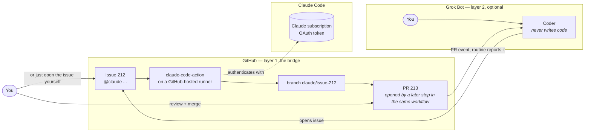

# Handoff

**Let your chat agent delegate coding to your coding agent — over GitHub, billed to a subscription instead of per token.**

**No server. No tunnel. No second meter.** Every other way of doing this needs at least one of the three.

> **Status: Phase 1 complete.** Both halves proven by running them, not by reading vendor docs. Every claim below links to the run that produced it — see [07-evidence.md](docs/07-evidence.md) and [TASKS.md](TASKS.md).

## Two layers. The first one is the product.

**Layer 1 — the bridge.** Open a GitHub issue containing `@claude`. The official Claude Code Action runs on a GitHub-hosted runner, authenticated with your **Claude subscription token** rather than an API key. It reads the issue, edits, runs your tests, pushes a branch, and a later step in the same workflow opens the pull request. You review and merge.

**This needs no chat bot at all.** A Claude subscription, a GitHub repo, and one workflow file.

**Layer 2 — the command centre (optional).** Point [Grok Bot](https://x.ai/bot) at the same repo and a chat message becomes the issue, and the finished pull request reports itself back into your group chat. Useful if you already pay for Grok Bot and want to brief work from your phone. **Skip it and layer 1 still works.**

## Why layer 1 exists

Coding agents that bill per token get expensive in a way you cannot see until the invoice. Grok Bot in particular bills coding on an unpublished weekly meter with no model choice, no spend cap and silent spillover into paid overage. A Claude Pro/Max subscription bills at a flat rate on a model you choose.

This moves exactly one category of work — code — across that billing boundary, and nothing else.

**Measured, not asserted:** one real task — issue in, reviewable pull request out — took **61 seconds** and **9 of 25** allowed turns, with **$0.00** of pay-as-you-go spend confirmed on the Anthropic Console. See [08-measurements.md](docs/08-measurements.md).

## What you need

| | Required? | Why |
|---|---|---|
| A **Claude** Pro, Max, Team or Enterprise subscription | **Yes** | Pays for the coding. Generate the token with `claude setup-token`. |
| A **GitHub** account and a repository | **Yes** | The bridge. Actions minutes are the only other cost, and one task above used ~60s. |
| A **Grok Bot** (Cursor) subscription | **No** | Layer 2 only. Everything in layer 1 works without it. |
| A server | **No** | There isn't one. That is the point. |

## How it works



**Layer 1, which is all you need:**

1. Open an issue containing `@claude` and a clear brief. Yourself, from GitHub.
2. The official [Claude Code GitHub Action](https://code.claude.com/docs/en/github-actions) runs on a GitHub-hosted runner, authenticated with your **Claude subscription OAuth token** — not an API key.
3. Claude Code reads the issue, edits, runs tests, and **pushes a branch**. It does not open the pull request — the action has no tool for that. A later step in the *same* workflow opens it, which costs no model turns and makes the `pull_request opened` event fire.
4. You review and merge. **The merge is the approval.**

**Layer 2, if you want it:**

5. A **Coder** bot writes step 1's issue from a one-line ask, and never writes code itself.
6. A Grok Bot **routine** catches the pull-request event and reports it back into your group chat, unprompted.

Both layer 2 steps are proven — see the runs in [07-evidence.md](docs/07-evidence.md) — but they are additions, not prerequisites.

## What you get

| | |
|---|---|
| Servers to run | **0** |
| Who pays for the code | your Claude subscription — **$0.00** metered spend, confirmed on the Console |
| Approval gate | your merge |
| Who can trigger a run | only accounts with repo write access |
| Measured task time | **61s** issue to pull request, 9 of 25 turns |

**On prompt injection:** the write-access check is *not* an injection defence, and this project used to claim it was. It controls who can start a run; it does not control what text reaches Claude. A comment from someone with no write access is still in the prompt when someone with write access says `@claude`. See [05-security.md](docs/05-security.md) for what actually contains it.

## Honest limits

This project's history is confident claims that turned out to be false — seventeen of them, removed after being checked. So:

- **Never run against a large or complex codebase.** Every measurement here comes from a small trial repo. A real project will look different and we have not measured one.
- **The report-back in layer 2 usually says `tests pending`** — by design. It fires when the pull request opens, while checks are still queued.
- **One run per test.** Nothing here speaks to reliability over weeks.
- Anything not verified by a run says so, in [07-evidence.md](docs/07-evidence.md).

## Quick start

See [docs/03-setup-guide.md](docs/03-setup-guide.md) — it has the checks at each step. Short version:

```bash
# 1. In the repo you want Claude to work on.
#    setup-token opens a browser; copy what it prints, then paste at the prompt.
#    Do NOT wrap it in $(...) — that swallows the browser flow.
claude setup-token
gh secret set CLAUDE_CODE_OAUTH_TOKEN

mkdir -p .github/workflows
cp templates/claude.yml .github/workflows/claude.yml
# Only if the repo has no CLAUDE.md yet — this OVERWRITES:
cp templates/CLAUDE.md.template CLAUDE.md

# 2. Install the Claude GitHub App: https://github.com/apps/claude
# 3. Settings -> Actions -> General -> tick
#    "Allow GitHub Actions to create and approve pull requests" (off by default)
# 4. Open an issue containing "@claude" from your own account. Get a PR back.
# 5. Only then: a fine-grained token on your own account, Issues-only, one repo
#    (setup guide Step 3), then the Coder bot. A dedicated machine account is a
#    later attribution upgrade, not a prerequisite — see D5a.
```

## Documentation

| Doc | What it answers |
|---|---|
| [00-overview](docs/00-overview.md) | Why this exists, what it is not |
| [01-architecture](docs/01-architecture.md) | Components, flows, boundaries — with diagrams |
| [02-decisions](docs/02-decisions.md) | Every architectural choice and the alternative it beat |
| [03-setup-guide](docs/03-setup-guide.md) | Step-by-step, with verification at each step |
| [04-operations](docs/04-operations.md) | Meters, brakes, monitoring, runbooks |
| [05-security](docs/05-security.md) | Threat model, what lives where |
| [06-roadmap](docs/06-roadmap.md) | Phases, acceptance tests, when a server comes back |
| [07-evidence](docs/07-evidence.md) | The research behind the pain point, and our own runs |
| [08-measurements](docs/08-measurements.md) | What a real task actually cost |

## Licence

MIT. This is a template: every user runs it with their own tokens in their own repos. Nothing here routes anyone else's requests through your subscription.
