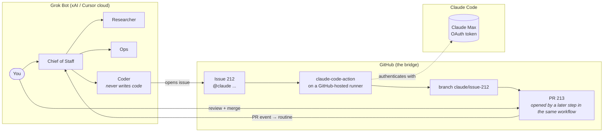

# grokbot-claude-bridge

**Run Grok Bot as your command centre. Run every line of code on Claude Code, billed to your Claude subscription. Use GitHub as the bridge. No servers.**

> Status: design complete, implementation starting. See [TASKS.md](TASKS.md).

## The problem in one sentence

Grok Bot bills coding on an unpublished weekly meter with no model choice, no spend cap and silent spillover into paid overage. Claude Max bills coding at a flat rate on a model you choose. This project moves exactly one category of work — code — across that billing boundary, and nothing else.

## How it works



1. You ask the Chief of Staff for something that needs engineering.
2. It delegates to the **Coder** bot, whose only job is to open a GitHub issue with `@claude` and a clear brief.
3. The official [Claude Code GitHub Action](https://code.claude.com/docs/en/github-actions) runs on a GitHub-hosted runner, authenticated with your **Claude subscription OAuth token** — not an API key.
4. Claude Code reads the issue, edits, runs tests, and **pushes a branch**. It does not open the pull request — the action has no tool for that. A later step in the *same* workflow opens it, which costs no model turns and makes the `pull_request opened` event fire.
5. A Grok Bot **routine** catches that event and the Chief of Staff tells you it's ready.
6. You review and merge. **The merge is the approval.**

## What you get

| | |
|---|---|
| Servers to run | **0** |
| Meters Grok Bot pays for | coordination only |
| Meters Claude Max pays for | all code |
| Approval gate | your merge |
| Who can trigger a run | only accounts with repo write access |
| Time to first PR | ~2 hours |

**On prompt injection:** the write-access check is *not* an injection defence, and this project used to claim it was. It controls who can start a run; it does not control what text reaches Claude. A comment from someone with no write access is still in the prompt when someone with write access says `@claude`. See [05-security.md](docs/05-security.md) for what actually contains it.

**Measured, not asserted:** one real task — issue in, reviewable pull request out — took 63 seconds and 10 of 25 allowed turns, with **$0.00** of pay-as-you-go spend. See [07-evidence.md](docs/07-evidence.md) and [08-measurements.md](docs/08-measurements.md).

## Quick start

See [docs/03-setup-guide.md](docs/03-setup-guide.md) — it has the checks at each step. Short version:

```bash
# 1. In the repo you want Claude to work on.
#    setup-token opens a browser; copy what it prints, then paste at the prompt.
#    Do NOT wrap it in $(...) — that swallows the browser flow.
claude setup-token
gh secret set CLAUDE_CODE_OAUTH_TOKEN

mkdir -p .github/workflows
cp templates/claude.yml .github/workflows/claude.yml
# Only if the repo has no CLAUDE.md yet — this OVERWRITES:
cp templates/CLAUDE.md.template CLAUDE.md

# 2. Install the Claude GitHub App: https://github.com/apps/claude
# 3. Settings -> Actions -> General -> tick
#    "Allow GitHub Actions to create and approve pull requests" (off by default)
# 4. Open an issue containing "@claude" from your own account. Get a PR back.
# 5. Only then: a fine-grained token on your own account, Issues-only, one repo
#    (setup guide Step 3), then the Coder bot. A dedicated machine account is a
#    later attribution upgrade, not a prerequisite — see D5a.
```

## Documentation

| Doc | What it answers |
|---|---|
| [00-overview](docs/00-overview.md) | Why this exists, what it is not |
| [01-architecture](docs/01-architecture.md) | Components, flows, boundaries — with diagrams |
| [02-decisions](docs/02-decisions.md) | Every architectural choice and the alternative it beat |
| [03-setup-guide](docs/03-setup-guide.md) | Step-by-step, with verification at each step |
| [04-operations](docs/04-operations.md) | Meters, brakes, monitoring, runbooks |
| [05-security](docs/05-security.md) | Threat model, what lives where |
| [06-roadmap](docs/06-roadmap.md) | Phases, acceptance tests, when a server comes back |
| [07-evidence](docs/07-evidence.md) | The research behind the pain point, and our own runs |
| [08-measurements](docs/08-measurements.md) | What a real task actually cost |

## Licence

MIT. This is a template: every user runs it with their own tokens in their own repos. Nothing here routes anyone else's requests through your subscription.
