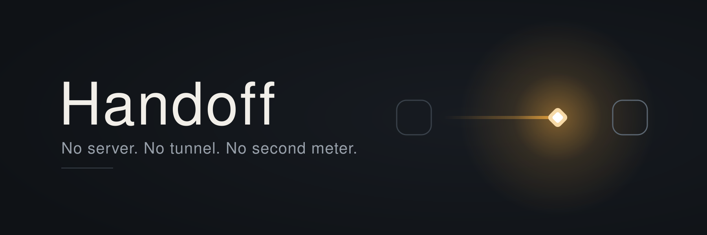
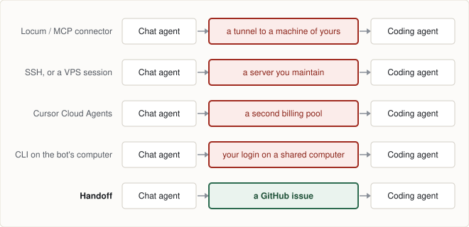
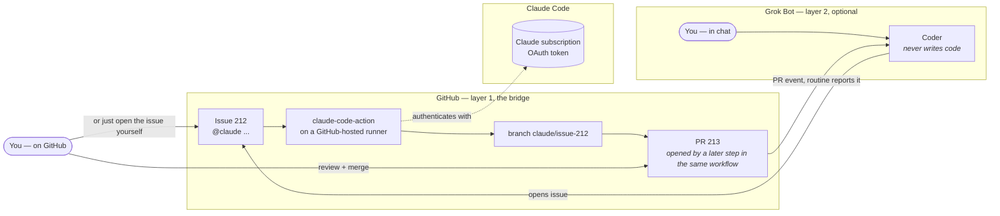

<p align="center">
  
</p>

<p align="center">
  <a href="LICENSE"></a>
  <a href="../../actions/workflows/ci.yml"></a>
  <a href="AGENTS.md"></a>
  
</p>

# Handoff

**Let your chat agent delegate coding to your coding agent — over GitHub, billed to a subscription instead of per token.**

**No server. No tunnel. No second billing pool. No coding login on a shared computer.** Every other way we found needs at least one of the four.

<picture>
  <source media="(prefers-color-scheme: dark)" srcset="assets/handoff-chains-dark.svg">
  
</picture>

Everybody builds the same chain. **The argument is only ever about the middle box.**

The fourth row is why this list says *four* and not three. Installing the coding CLI straight onto
the bot's computer needs no server, no tunnel and no second pool — it beats the other three on every
axis. What it costs is putting your coding credential on a machine [05-security.md](docs/05-security.md)
tells you to assume is compromised and shared with every other bot on the account, and packages
installed there are wiped on image updates. We would rather state the axis than quietly omit the
approach that dodges the other three.

Named alternatives, what each one actually requires, and the cost Handoff *does* add — GitHub
Actions minutes, which we cannot yet price — are in [07-evidence.md](docs/07-evidence.md).

> **Status: the bridge works end to end. The project is not finished.** An issue becomes a reviewable pull request, and the result reports itself back into a group chat — both watched happening on 2026-09-06, not read out of vendor docs. What is still open is unticked in [TASKS.md](TASKS.md), including the token-scope control test and a fresh-eyes install. Every claim below links to the run that produced it — see [07-evidence.md](docs/07-evidence.md).

> **Setting this up with an AI agent?** Point it at **[AGENTS.md](AGENTS.md)** — the install guide written for agents rather than people. It covers what the agent can do on its own, the three things it cannot do and must hand back to you, and how to check the result. Handing your agent this repository's URL and saying "set this up" is a supported way to install Handoff.

## Works with

Named in text, not logos — these are other companies' trademarks, and Handoff is not affiliated with or endorsed by any of them.

| | Chat side | Coding side |
|---|---|---|
| **Supported today** | Grok Bot (xAI / Cursor) | Claude Code |
| **Designed for, not yet built** | any chat agent that can open a GitHub issue | any coding agent with a GitHub Action |

Nothing in the bridge is vendor-specific: it is a GitHub issue in, a pull request out. Adding a coding agent means a different workflow file, not a different design.

## Two layers. The first one is the product.

**Layer 1 — the bridge.** Open a GitHub issue containing `@claude`. The official Claude Code Action runs on a GitHub-hosted runner, authenticated with your **Claude subscription token** rather than an API key. It reads the issue, edits, runs your tests, pushes a branch, and a later step in the same workflow opens the pull request. You review and merge.

**This needs no chat bot at all.** A Claude subscription, a GitHub repo, and one workflow file.

**Layer 2 — the command centre (optional).** Point [Grok Bot](https://x.ai/bot) at the same repo and a chat message becomes the issue, and the finished pull request reports itself back into your group chat. Useful if you already pay for Grok Bot and want to brief work from your phone. **Skip it and layer 1 still works.**

## Why layer 1 exists

Coding agents that bill per token get expensive in a way you cannot see until the invoice. Grok Bot in particular meters coding on a **weekly** allowance whose size is not published per plan, with **no model picker** — billing follows whichever model the router serves — and **no Grok Bot-specific spend cap**. When the weekly pool is exhausted, usage continues on shared on-demand spend *if you have that enabled*; you can set the account-wide on-demand limit to `$0`, and [the setup guide](docs/03-setup-guide.md) tells you to. A Claude Pro/Max subscription bills at a flat rate on a model you choose.

Each of those is a vendor-documented fact with a source in [07-evidence.md](docs/07-evidence.md) — **not** a measurement. We have never measured a Grok Bot allowance, and this project does not claim to.

This moves exactly one category of work — code — across that billing boundary, and nothing else.

**Measured, not asserted:** one real task — issue in, reviewable pull request out — took **61 seconds** and **9 of 25** allowed turns, with **$0.00** of pay-as-you-go spend confirmed on the Anthropic Console. See [08-measurements.md](docs/08-measurements.md).

## What you need

| | Required? | Why |
|---|---|---|
| A **Claude** Pro, Max, Team or Enterprise subscription | **Yes** | Pays for the coding. Generate the token with `claude setup-token`. |
| A **GitHub** account and a repository | **Yes** | The bridge. Actions minutes are the only other cost, and one task above used ~60s. |
| A **Grok Bot** (Cursor) subscription | **No** | Layer 2 only. Everything in layer 1 works without it. |
| A server | **No** | There isn't one. That is the point. |

## How it works



Both `You` boxes are the same person — Mermaid puts a node in one subgraph only, so briefing from
chat and reviewing on GitHub have to be drawn separately.

<!-- Deliberately no classDef / style / %%{init}%% in this diagram. GitHub picks Mermaid's theme
     from the reader's colour mode; hard-coded hex is fixed paint in BOTH modes, so a light fill
     gets dark-mode's light text on top of it. Colour-free Mermaid is theme-correct for free.
     Verified 2026-09-07 against GitHub's deployed mermaidMarkdown bundle. -->


**Layer 1, which is all you need:**

1. Open an issue containing `@claude` and a clear brief. Yourself, from GitHub.
2. The official [Claude Code GitHub Action](https://code.claude.com/docs/en/github-actions) runs on a GitHub-hosted runner, authenticated with your **Claude subscription OAuth token** — not an API key.
3. Claude Code reads the issue, edits, runs tests, and **pushes a branch**. It does not open the pull request — the action has no tool for that. A later step in the *same* workflow opens it, which costs no model turns and makes the `pull_request opened` event fire.
4. You review and merge. **The merge is the approval.**

**Layer 2, if you want it:**

5. A **Coder** bot writes step 1's issue from a one-line ask, and never writes code itself.
6. A Grok Bot **routine** catches the pull-request event and reports it back into your group chat, unprompted.

Both layer 2 steps are proven — see the runs in [07-evidence.md](docs/07-evidence.md) — but they are additions, not prerequisites.

## What you get

| | |
|---|---|
| Servers to run | **0** |
| Who pays for the code | your Claude subscription — **$0.00** metered spend, confirmed on the Console |
| Approval gate | your merge |
| Who can trigger a run | only accounts with repo write access |
| Measured task time | **61s** issue to pull request, 9 of 25 turns |

**On prompt injection:** the write-access check is *not* an injection defence, and this project used to claim it was. It controls who can start a run; it does not control what text reaches Claude. A comment from someone with no write access is still in the prompt when someone with write access says `@claude`. See [05-security.md](docs/05-security.md) for what actually contains it.

## Honest limits

This project's history is confident claims that turned out to be false — four load-bearing ones, one of them repeated across seventeen places in the docs, all rewritten rather than patched after being checked. The record is the **Correction** entries in [02-decisions.md](docs/02-decisions.md) and `git log --grep=correct`. So:

- **Never run against a large or complex codebase.** Every measurement here comes from a small trial repo. A real project will look different and we have not measured one.
- **The report-back in layer 2 usually says `tests pending`** — by design. It fires when the pull request opens, while checks are still queued.
- **One run per test.** Nothing here speaks to reliability over weeks.
- Anything not verified by a run says so, in [07-evidence.md](docs/07-evidence.md).

## Quick start

> Doing this by hand? You are in the right place. Handing it to an agent? → **[AGENTS.md](AGENTS.md)**. Same install, two audiences.

See [docs/03-setup-guide.md](docs/03-setup-guide.md) — it has the checks at each step. Short version:

```bash
# 0. Get Handoff itself. The copies below read from it.
git clone <this repository's URL> ~/handoff

# 1. In the repo you want Claude to work on.
#    setup-token opens a browser; copy what it prints, then paste at the prompt.
#    Do NOT wrap it in $(...) — that swallows the browser flow.
claude setup-token
gh secret set CLAUDE_CODE_OAUTH_TOKEN

mkdir -p .github/workflows
cp ~/handoff/templates/claude.yml .github/workflows/claude.yml
# Only if the repo has no CLAUDE.md yet — this OVERWRITES:
cp ~/handoff/templates/CLAUDE.md.template CLAUDE.md

# …or skip the two copies and let the script do them:
bash ~/handoff/scripts/setup.sh

# 2. Install the Claude GitHub App: https://github.com/apps/claude
# 3. Settings -> Actions -> General -> tick
#    "Allow GitHub Actions to create and approve pull requests" (off by default)
# 4. Open an issue containing "@claude" from your own account. Get a PR back.
# 5. Only then: a fine-grained token on your own account, Issues-only, one repo
#    (setup guide Step 3), then the Coder bot. A dedicated machine account is a
#    later attribution upgrade, not a prerequisite — see D5a.
```

## Optional extras

| File | What it adds |
|---|---|
| [`templates/weekly-cost.yml`](templates/weekly-cost.yml) | A Monday report on a labelled issue: pull requests merged, how many runs it took, runner time per merged pull request. **Uses no model turns** — it is `gh` and `awk`, not an agent. Copy it next to `claude.yml` if you want it. |

## Documentation

| Doc | What it answers |
|---|---|
| [00-overview](docs/00-overview.md) | Why this exists, what it is not |
| [01-architecture](docs/01-architecture.md) | Components, flows, boundaries — with diagrams |
| [02-decisions](docs/02-decisions.md) | Every architectural choice and the alternative it beat |
| [03-setup-guide](docs/03-setup-guide.md) | Step-by-step, with verification at each step |
| [04-operations](docs/04-operations.md) | Meters, brakes, monitoring, runbooks |
| [05-security](docs/05-security.md) | Threat model, what lives where |
| [06-roadmap](docs/06-roadmap.md) | Phases, acceptance tests, when a server comes back |
| [07-evidence](docs/07-evidence.md) | The research behind the pain point, and our own runs |
| [08-measurements](docs/08-measurements.md) | What a real task actually cost |

**Contributing:** [CONTRIBUTING.md](CONTRIBUTING.md) · **Release history:** [CHANGELOG.md](CHANGELOG.md) · **Installing with an agent:** [AGENTS.md](AGENTS.md)

## Licence

MIT. This is a template: every user runs it with their own tokens in their own repos. Nothing here routes anyone else's requests through your subscription.
