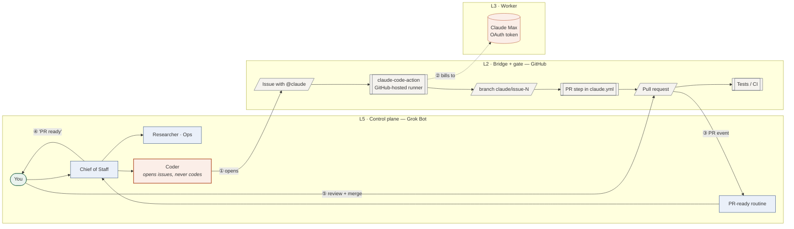
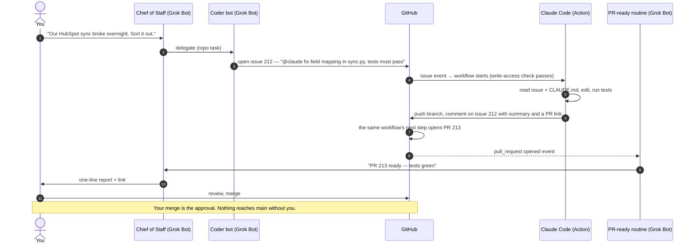
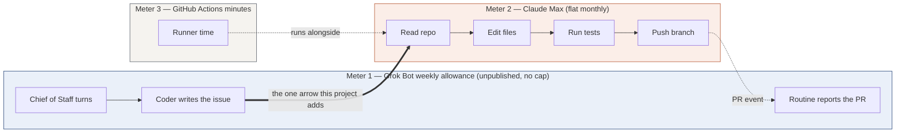
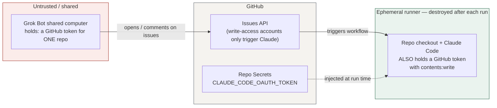

# 01 — Architecture

## Components

| Component | Runs where | Pays with | Job |
|---|---|---|---|
| **Chief of Staff** bot | Grok Bot cloud | Grok Bot weekly allowance | Your single point of contact. Delegates. Reports. |
| **Coder** bot | Grok Bot cloud | Grok Bot weekly allowance (a few turns per task) | Turns a request into a well-formed GitHub issue containing `@claude`. **Never writes code.** |
| **GitHub issue / PR** | GitHub | free | The task ledger, the conversation, the approval gate. |
| **claude-code-action** | GitHub-hosted runner | GitHub Actions minutes | Runs Claude Code against the repo when `@claude` is mentioned. |
| **Claude Code** | inside the action | **Claude Max OAuth token** | Reads the issue, edits, tests, **pushes a branch**. It has no tool to open a pull request. |
| **the PR step in `claude.yml`** | the same runner, after Claude | seconds | Opens the pull request the action does not. No model turns. See D12. |
| **PR-ready routine** | Grok Bot cloud | Grok Bot allowance (one turn) | Catches the PR event, tells the Chief of Staff. |
| **You** | phone / laptop | — | Review, merge, approve anything irreversible. |

## System view

Layer numbers are a naming convention only; there is no separate v3 design document in this repo. L4 (engineering manager) and L1 (substrate) are intentionally absent: GitHub Actions is stateless and GitHub-hosted.

## Sequence: one task, end to end

Typical wall-clock: 1–2 min runner start + task time. Grok Bot spends ~3–5 turns total. Claude Max absorbs the rest.

## Billing boundary

The whole project is the arrow from B to D. Everything to the right of it used to be on Meter 1.

## State and memory

| Kind of state | Lives in |
|---|---|
| Task list | GitHub Issues (canonical). Notion, if used, is a view. |
| Conversation about a task | The issue thread. `@claude` follow-ups go there. |
| Repo conventions, rules, "tests must pass" | `CLAUDE.md` in the consumer repo |
| What Claude did | A **single comment** on the issue, which Claude overwrites as it works, plus the action logs. There is no Claude-authored PR description. |
| Bot behaviour | Bot descriptions in Grok Bot (versioned here under `templates/bots/`) |

There is no session state. That is a feature: nothing to back up, nothing to get stuck.

## Trust boundaries

- The Grok Bot computer is shared by every bot on the account. It holds a GitHub token for one repo. **That token is a spam control, not a privilege control** — the action checks the *account's* write access, not the *token's* scope, so anyone holding it can start a full run. See D5 and `05-security.md`.
- The Claude OAuth token exists only in GitHub Secrets and the ephemeral runner.
- **The runner holds more than the Claude token.** It also gets a GitHub App installation token and the workflow's own `GITHUB_TOKEN`, which this template grants `contents: write`, `pull-requests: write`, `issues: write`, `id-token: write` and `actions: read` (`templates/claude.yml`). So a successful injection can push code, not merely spend quota.
- The action runs **two** checks on the triggering actor and **fails the run** when either rejects it: the account must have **write access**, and it must not be a bot (<https://code.claude.com/docs/en/github-actions> §"Who can trigger runs", read 2026-09-06). That stops strangers *spending your quota*. It does **not** stop prompt injection: every comment on the thread reaches Claude regardless of who wrote it, so a read-only account can plant text that Claude reads the next time someone with write access says `@claude`. See `05-security.md`.

See `05-security.md` for the full threat model.

## What this deliberately leaves out (and why)

| Left out | Why | Comes back when |
|---|---|---|
| VPS / persistent session | Not needed to move billing; adds a server to maintain | You need memory across tasks or private-network access |
| Permission relay to chat | The PR already gates every change | Tasks need mid-run human decisions |
| MCP connector / tunnel (Locum) | Extra moving part, ToS grey zone | Never, in this design |
| Observability stack | GitHub Actions logs + two usage dashboards are enough | A client asks for reports |
| Self-hosted runner | Hosted runners are free enough and safer | Tasks exceed included minutes or need local tools |
