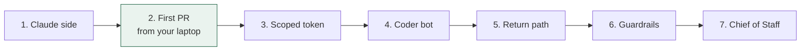

# 03 — Setup guide

Each step ends with a check. Don't move on until the check passes.



Step 2 is the whole thesis test. If a PR comes back billed to your Max plan, everything else is wiring.

## Prerequisites

> **Before anything Grok Bot related:** accounts on **Legacy Privacy Mode cannot start Grok Bot** — *"Accounts using Legacy Privacy Mode must move to a supported Cursor data setting before Grok Bot can start."* Change it at <https://cursor.com/dashboard/settings?openPrivacy=true>. Grok Bot is a **desktop and mobile app only** — there is no web app, no Slack app, no X surface. Download from <https://x.ai/bot>. Creating and editing routines is **desktop-only**.


- A Claude subscription: **Pro, Max, Team or Enterprise all work.** Max is a capacity recommendation, not a requirement.
- A GitHub repo you want Claude to work on (private recommended). The `gh` CLI logged in, with **admin** on that repo.
- **No organisation is required.** Start with a fine-grained token on **your own** account, scoped to `Issues: read and write` on the one target repo (D5a). A dedicated machine account is an attribution upgrade you can add later; it *does* need an org-owned repo (#46), which is why it is not where you start.
- Grok Bot access via an eligible plan (Cursor Pro or SuperGrok at time of writing — check current bundling).
- Claude Code installed locally and logged in with that subscription.

## Step 1 — Claude side (10 min)

```bash
cd <your-repo>

# 1a. Generate a long-lived subscription token (Pro/Max/Team/Enterprise).
#     This opens a BROWSER. Approve there; the token then prints here. Copy it.
#     Do NOT wrap this in $(...) — command substitution swallows the browser flow.
claude setup-token

# 1b. Store it as a repo secret (GitHub has no user-level secrets).
#     Paste at the prompt. Nothing appears as you paste; that is deliberate.
gh secret set CLAUDE_CODE_OAUTH_TOKEN

# 1c. Install the Claude GitHub App on this repo
#     https://github.com/apps/claude
#     Or run `claude`, then type /install-github-app at the prompt.
#     (`claude /install-github-app` does NOT work — that is a slash command
#      inside a session, not a CLI argument.)

# 1d. Add the workflow
mkdir -p .github/workflows
cp <bridge>/templates/claude.yml .github/workflows/claude.yml

# 1e. Repo instructions. STOP AND READ:
#     If this repo already has a CLAUDE.md, `cp` DESTROYS it. Merge the
#     template in by hand instead. Only run this on a repo that has none.
[ -e CLAUDE.md ] && echo "CLAUDE.md exists - merge by hand, do not copy" \
  || cp <bridge>/templates/CLAUDE.md.template CLAUDE.md   # then edit for your repo

git add -A && git commit -m "add claude bridge" && git push
```

**1f. Enable one repository setting.** Settings → Actions → General → Workflow permissions → tick **"Allow GitHub Actions to create and approve pull requests"**. It is **off by default on every repository**, and without it the pull-request workflow fails with `GitHub Actions is not permitted to create or approve pull requests`.

**Check:** `gh secret list` shows `CLAUDE_CODE_OAUTH_TOKEN`; the workflow file is on the **default branch** (Actions only triggers issue events from there); the setting in 1f is ticked.

## Step 2 — First PR from your own account (15 min)

```bash
gh issue create --title "Add a CONTRIBUTING.md" \
  --body "@claude Add a short CONTRIBUTING.md describing how to run the tests.
Done means: the file exists and the tests still pass."
```

Watch **Actions** in the repo. Within ~1–2 minutes a run starts. Claude comments on the issue, does the work, and **pushes a branch**. A later step in the same workflow then opens the pull request — Claude itself cannot, and will instead post a pre-filled "Create PR" link.

**Check:**
- A pull request exists. It is opened by **`github-actions`**, not by the Claude app — that is expected, see D12.
- Anthropic Console shows **no** API spend for the run: <https://platform.claude.com/usage>, which Anthropic calls authoritative for billing.
- Ignore any `total_cost_usd` in the run log. That figure is a notional list-price estimate printed regardless of how you pay; on a subscription it is not a charge.
- If the run fails with "could not resolve authentication credentials": re-run `claude setup-token`, update the secret, retry. If it still fails, see runbook R2 in `04-operations.md`.

Stop here for a day if you like. You've proven the expensive half.

**Check everything at once, any time:**

```bash
scripts/doctor.sh OWNER/REPO
```

## Step 3 — A scoped token for the bot (15 min)

Mint the token on **your own** account. Skip the machine account for now — it buys attribution,
not security (D5a), and it needs an org-owned repo you may not have.

1. Settings → Developer settings → Fine-grained tokens → New:
   - Resource owner: **you**
   - Repository access: **only** the target repo
   - Permissions: **Issues: Read and write**. Nothing else.
   - Expiry: 90 days. Put the date in your calendar.
2. Copy the token; you'll paste it into the GitHub connector in the next step.

> **When you later upgrade to a machine account, the repo must be org-owned.** GitHub lists as a
> current gap: *"using fine-grained personal access token to contribute to repositories where the
> user is an outside or repository collaborator."*
> — <https://docs.github.com/en/authentication/keeping-your-account-and-data-secure/managing-your-personal-access-tokens>, read 2026-09-06
>
> On a personally-owned repo the only working credential for a *second* account is a **classic**
> PAT with the full `repo` scope, which grants read/write to all your code — the opposite of
> scoped, on a machine you are told to assume is compromised. **This does not affect a fine-grained
> token on your own account for a repo you own**, which is what step 1 above tells you to make.
>
> The machine account also needs **write access** to the repo, and an **organisation owner must
> approve its token** before it works. That is GitHub's default policy; budget a step for it.

**Check the scope, in two calls.** Replace `CONTROL_REPO` with one you own — see the trap below.

```bash
export BOT_TOKEN=github_pat_...

# expect 200 — the repo you scoped it to
curl -s -o /dev/null -w "%{http_code}\n" -H "Authorization: Bearer $BOT_TOKEN" \
  https://api.github.com/repos/OWNER/REPO/issues

# expect 404 — a repo outside the scope
curl -s -o /dev/null -w "%{http_code}\n" -H "Authorization: Bearer $BOT_TOKEN" \
  https://api.github.com/repos/OWNER/CONTROL_REPO
```

`404` rather than `403` is correct: GitHub returns "not found" for things you have no access to, so it does not leak the existence of private repos.

> **The trap that makes this test vacuous.** Your control repo **must exist**, be **private**, be **owned by you**, and be **outside the token's scope** — all four. A repo that does not exist returns `404` too, so if you point this at a typo, a renamed repo, or one you deleted, it passes while proving nothing. Confirm the control repo is real first:
>
> ```bash
> gh repo view OWNER/CONTROL_REPO --json name,visibility
> ```
>
> We nearly shipped this test naming a repo that had ceased to exist. A control that cannot fail is not a control.

**Know what this token is and is not.** It is a **spam control**, not a privilege control. The action checks the *account's* write access, not the *token's* scope, so whoever holds this token can start a full Claude run with write access to the repo, on a prompt they wrote. What actually contains the damage: the runner is ephemeral and holds no production credentials, the repo is private, and **you** are the merge gate. See D5.

## Step 4 — Coder bot in Grok Bot (20 min)

1. Create a bot named **Coder**. Paste `templates/bots/coder.md` as its description. Replace `OWNER/REPO`.
2. **No second token hand-off is needed here.** Coder reaches GitHub through the connector you configured above, which already holds the token. Grok Bot's **secure secret request** (the bot asks, you paste into a masked field) is the right channel *if a bot ever needs a secret of its own* — but not for this. Either way, never paste a token into chat.
3. Tell Coder: *"Open an issue asking @claude to add a `docs/HELLO.md` with one sentence."*

**Check:** an issue appears on GitHub authored by the account behind the token, **the action actually runs**, and a pull request comes back. Grok Bot's usage meter moved by a few turns, not a chunk.

Check that the *action ran*, not merely that the issue was created. Those are different failures with the same appearance.

### Which GitHub identity the bot uses — do not skip this

xAI's default is that **bots act as you**: *"Bots act as the signed-in member… every action stays attributable to a named member."* Under **D5a that is what we want** — the action's write-access check tests the *account*, so a token on an account with write access is what makes it pass. A dedicated machine account is an **attribution upgrade, not a prerequisite**: it makes bot-opened issues distinguishable from your own, and it needs an org-owned repo (#46). Start without it.

What still matters is *how* the credential is held. Use the **PAT-flavoured GitHub connector** and paste a **fine-grained token on your own account**, scoped to `Issues: read and write` on the one target repo, into its **secure credential field** — never into chat. A note from 2026-09-05 records the vendor as saying the Bot does not receive the raw key and that it does not enter the transcript or model context, but **that wording could not be re-located on docs.x.ai on 2026-09-06 — treat it as unverified** (see D5). Scope the token so it would not matter if the claim were false. Prefer the connector over the "Sign in with GitHub" button, which carries whatever access you already have rather than only what you scoped.

Be clear-eyed about what that scope buys. Per #47 it is a **spam control, not a privilege control** — whoever holds the token can start a full Claude run on a prompt they wrote. What actually contains the blast radius is that the runner is ephemeral, the tool allow-list is narrow, the repo is private, and you are the merge gate.

**Then prove it, in about a minute.** Ask the bot to open an issue, and inspect the exact field the action checks:

```bash
gh api repos/OWNER/REPO/issues/N \
  --jq '{login: .user.login, type: .user.type, app: .performed_via_github_app.slug}'
```

| Result | Meaning | Verdict |
|---|---|---|
| `type: "Bot"`, login ends `[bot]` | A GitHub App | **Rejected by the action.** Do not "fix" this with `allowed_bots` — any `[bot]` actor skips the permission check entirely, making that list your only access control. |
| `type: "User"`, login = **you** | The token you scoped is being used, and the account behind it has write access | ✅ **This is what D5a expects.** Confirm the token itself is fine-grained and limited to `Issues` on one repo — the login tells you the account, not the scope. |
| `type: "User"`, login = **a dedicated machine account** | The D5 attribution upgrade | ✅ Also correct, and better for audit trails. Needs an org-owned repo (#46), so it is not where you start. |

Then confirm the other half of the gate:

```bash
gh api repos/OWNER/REPO/collaborators/THAT_LOGIN/permission --jq .permission
```

Must be `write` or `admin`.

**A limit you cannot engineer around.** Grok Bot gives each *user* one shared computer, and connectors are account-wide: *"All of that user's Bots share one computer, and Bots isolate personalities and workspaces, not compute"*, and *"Any permitted connector is available to every Bot a member runs"* (<https://docs.x.ai/grok-bot/teams-and-enterprises>, read 2026-09-06). So the machine-account credential is available to **every bot on your account**, not just the Coder. "The Coder's token" is a convenient fiction — it is the account's token. Size its permissions accordingly.

## Step 5 — Return path (15 min)

1. Create the routine on the **Coder** bot — in Phase 1 it is the only bot that exists. Send it the message block in `templates/routines/pr-ready.md` verbatim. Once you create the Chief of Staff in Step 7, move the routine there; reporting is its job.
2. Trigger: the bot's **built-in GitHub connection**, pull request opened, on the target repo. Not an inbound webhook — the webhook trigger is the one Cursor staff flagged as not counting as user intent, and we have never tested it.
3. Action: post one line in the project group chat with the PR link and CI status.

**Check, in two passes — and pass 1 alone does not count.**

| Pass | Open the pull request as | Why |
|---|---|---|
| 1 | you, by hand | Cheapest smoke test. Proves the routine fires at all. |
| 2 | **the bridge** — an `@claude` issue, so `github-actions` opens the PR | The only pass that matters. A routine can watch for pull requests from a human and never see the ones the automation opens; that blind spot is what let the first PR-opening design pass "verification" twice (#61). |

Both passes must post the line in the group chat. **We have not measured how long the report takes
to arrive** — on our two runs it did arrive and neither needed an approval tap, but the delay was
never timed. Do not treat any particular latency as expected.

## Step 6 — Guardrails (10 min)

1. In Grok Bot → Auto Review, add the rules from `templates/auto-review-rules.md`.
2. Set the Cursor account **on-demand limit** to `$0` (or a small number) so the weekly pool can't silently spill.
3. Add to **every bot's description** (there is no channel charter — see below): *"At most three rounds of bot-to-bot discussion before reporting to me."*

**Check:** ask Ops to "email the client about the PR" — it must stop and ask you.

## Step 7 — Create the Chief of Staff (10 min)

Paste `templates/bots/chief-of-staff.md` into **Bot actions → Edit Profile → description**. Then create a **group chat** (New → select 2–6 bots) containing the Chief of Staff and the Coder.

Note what a group chat is and is not: it holds **bots only, 2–6 of them**, plus you as the message sender. There is no second human, and there is **no charter or instructions field** — standing rules live in each bot's description. Group chats also count against the account cap of **50 bots and group chats combined**.

**Check:** give it a two-step task without saying who does what ("find out which HubSpot fields changed this week, then fix our mapping"). It should research, then delegate to Coder, then report once.

## You're done when

- Tasks flow phone → Chief of Staff → Coder → issue → PR → report → merge, with you touching only the first and last step.
- Two dashboards open once a day: Grok Bot usage %, Claude usage. Both boring.
