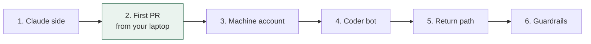

# 03 — Setup guide

Each step ends with a check. Don't move on until the check passes.



Step 2 is the whole thesis test. If a PR comes back billed to your Max plan, everything else is wiring.

## Prerequisites

- Claude Max (5x is the realistic starting tier).
- A GitHub repo you want Claude to work on (private recommended). The `gh` CLI logged in.
- Grok Bot access via an eligible plan (Cursor Pro or SuperGrok at time of writing — check current bundling).
- Claude Code installed locally and logged in with the Max account.

## Step 1 — Claude side (10 min)

```bash
cd <your-repo>

# 1a. Generate a long-lived subscription token (Pro/Max/Team/Enterprise)
claude setup-token
# copy the token it prints

# 1b. Store it as a repo secret (GitHub has no user-level secrets)
gh secret set CLAUDE_CODE_OAUTH_TOKEN

# 1c. Install the Claude GitHub App on this repo
#     https://github.com/apps/claude   (or: claude /install-github-app)

# 1d. Add the workflow and repo instructions
mkdir -p .github/workflows
cp <bridge>/templates/claude.yml .github/workflows/claude.yml
cp <bridge>/templates/CLAUDE.md.template CLAUDE.md   # edit for your repo
git add -A && git commit -m "add claude bridge" && git push
```

**Check:** `gh secret list` shows `CLAUDE_CODE_OAUTH_TOKEN`; the workflow file is on the default branch.

## Step 2 — First PR from your own account (15 min)

```bash
gh issue create --title "Add a CONTRIBUTING.md" \
  --body "@claude Add a short CONTRIBUTING.md describing how to run the tests. Open a PR."
```

Watch **Actions** in the repo. Within ~1–2 minutes a run starts; Claude comments on the issue and opens a PR.

**Check:**
- A PR exists, opened by the Claude app.
- Anthropic Console shows **no** API spend for the run. Your Claude usage page shows the run against your subscription.
- If the run fails with "could not resolve authentication credentials": re-run `claude setup-token`, update the secret, retry. If it still fails, see runbook R2 in `04-operations.md`.

Stop here for a day if you like. You've proven the expensive half.

## Step 3 — Machine account for the bot (15 min)

1. Create a GitHub account for the bot (e.g. `<yourname>-coder-bot`). Enable 2FA.
2. Add it as a **collaborator with write access** on the target repo. (The action only responds to write-access accounts — this is deliberate.)
3. Logged in as the bot: Settings → Developer settings → Fine-grained tokens → New:
   - Repository access: **only** the target repo
   - Permissions: **Issues: Read and write**. Nothing else.
   - Expiry: 90 days. Put the date in your calendar.
4. Copy the token; you'll paste it into the Coder bot in the next step.

**Check:** with the bot's token, `curl` can create a test issue on the target repo and cannot read any other repo.

## Step 4 — Coder bot in Grok Bot (20 min)

1. Create a bot named **Coder**. Paste `templates/bots/coder.md` as its description. Replace `OWNER/REPO`.
2. Give it the token via Grok Bot's secure secret request (the bot asks; you paste). Never paste a token into chat.
3. Tell Coder: *"Open an issue asking @claude to add a `docs/HELLO.md` with one sentence."*

**Check:** an issue appears on GitHub authored by the machine account; the action runs; a PR comes back. Grok Bot's usage meter moved by a few turns, not a chunk.

If Grok Bot's built-in GitHub connector can open issues under an identity you control, prefer it and skip the token (see D5). Verify it actually creates the issue before trusting it.

## Step 5 — Return path (15 min)

1. Create a routine on the **Chief of Staff** bot from `templates/routines/pr-ready.md`.
2. Trigger: GitHub event, pull request opened, on the target repo.
3. Action: post one line in the project channel with the PR link and CI status.

**Check:** open a throwaway PR by hand; the Chief of Staff reports it within a couple of minutes.

## Step 6 — Guardrails (10 min)

1. In Grok Bot → Auto Review, add the rules from `templates/auto-review-rules.md`.
2. Set the Cursor account **on-demand limit** to `$0` (or a small number) so the weekly pool can't silently spill.
3. In every channel charter add: *"At most three rounds of bot-to-bot discussion before reporting to me."*

**Check:** ask Ops to "email the client about the PR" — it must stop and ask you.

## Step 7 — Create the Chief of Staff (10 min)

Paste `templates/bots/chief-of-staff.md`. Pin it. Open one project channel with Chief of Staff, Coder, and you.

**Check:** give it a two-step task without saying who does what ("find out which HubSpot fields changed this week, then fix our mapping"). It should research, then delegate to Coder, then report once.

## You're done when

- Tasks flow phone → Chief of Staff → Coder → issue → PR → report → merge, with you touching only the first and last step.
- Two dashboards open once a day: Grok Bot usage %, Claude usage. Both boring.
