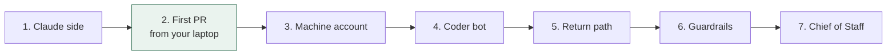

# 03 — Setup guide

Each step ends with a check. Don't move on until the check passes.



Step 2 is the whole thesis test. If a PR comes back billed to your Max plan, everything else is wiring.

## Prerequisites

- A Claude subscription: **Pro, Max, Team or Enterprise all work.** Max is a capacity recommendation, not a requirement.
- A GitHub repo you want Claude to work on (private recommended). The `gh` CLI logged in, with **admin** on that repo.
- **For Phase 1 only:** that repo must be **owned by a GitHub organisation**, not by your personal account. Step 3's machine-account token cannot be created otherwise — see the warning in Step 3. Steps 1 and 2 work fine on a personal repo.
- Grok Bot access via an eligible plan (Cursor Pro or SuperGrok at time of writing — check current bundling).
- Claude Code installed locally and logged in with that subscription.

## Step 1 — Claude side (10 min)

```bash
cd <your-repo>

# 1a. Generate a long-lived subscription token (Pro/Max/Team/Enterprise).
#     This opens a BROWSER. Approve there; the token then prints here. Copy it.
#     Do NOT wrap this in $(...) — command substitution swallows the browser flow.
claude setup-token

# 1b. Store it as a repo secret (GitHub has no user-level secrets).
#     Paste at the prompt. Nothing appears as you paste; that is deliberate.
gh secret set CLAUDE_CODE_OAUTH_TOKEN

# 1c. Install the Claude GitHub App on this repo
#     https://github.com/apps/claude
#     Or run `claude`, then type /install-github-app at the prompt.
#     (`claude /install-github-app` does NOT work — that is a slash command
#      inside a session, not a CLI argument.)

# 1d. Add the workflows
mkdir -p .github/workflows
cp <bridge>/templates/claude.yml         .github/workflows/claude.yml
cp <bridge>/templates/claude-open-pr.yml .github/workflows/claude-open-pr.yml

# 1e. Repo instructions. STOP AND READ:
#     If this repo already has a CLAUDE.md, `cp` DESTROYS it. Merge the
#     template in by hand instead. Only run this on a repo that has none.
[ -e CLAUDE.md ] && echo "CLAUDE.md exists - merge by hand, do not copy" \
  || cp <bridge>/templates/CLAUDE.md.template CLAUDE.md   # then edit for your repo

git add -A && git commit -m "add claude bridge" && git push
```

**1f. Enable one repository setting.** Settings → Actions → General → Workflow permissions → tick **"Allow GitHub Actions to create and approve pull requests"**. It is **off by default on every repository**, and without it the pull-request workflow fails with `GitHub Actions is not permitted to create or approve pull requests`.

**Check:** `gh secret list` shows `CLAUDE_CODE_OAUTH_TOKEN`; both workflow files are on the **default branch** (Actions only triggers issue events from there); the setting in 1f is ticked.

## Step 2 — First PR from your own account (15 min)

```bash
gh issue create --title "Add a CONTRIBUTING.md" \
  --body "@claude Add a short CONTRIBUTING.md describing how to run the tests.
Done means: the file exists and the tests still pass."
```

Watch **Actions** in the repo. Within ~1–2 minutes a run starts. Claude comments on the issue, does the work, and **pushes a branch**. The `claude-open-pr` workflow then opens the pull request — Claude itself cannot, and will instead post a pre-filled "Create PR" link.

**Check:**
- A pull request exists. It is opened by **`github-actions`**, not by the Claude app — that is expected, see D12.
- Anthropic Console shows **no** API spend for the run: <https://platform.claude.com/usage>, which Anthropic calls authoritative for billing.
- Ignore any `total_cost_usd` in the run log. That figure is a notional list-price estimate printed regardless of how you pay; on a subscription it is not a charge.
- If the run fails with "could not resolve authentication credentials": re-run `claude setup-token`, update the secret, retry. If it still fails, see runbook R2 in `04-operations.md`.

Stop here for a day if you like. You've proven the expensive half.

## Step 3 — Machine account for the bot (15 min)

> **The target repo must be owned by an organisation.** GitHub does not let an
> outside or repository collaborator create a fine-grained token for a repo they
> do not own — *"The major gaps in fine-grained personal access tokens are: …
> using fine-grained personal access token to contribute to repositories where
> the user is an outside or repository collaborator."* On a personally-owned
> repo the only working credential is a **classic** PAT with the full `repo`
> scope, which grants read/write access to all your code — the opposite of
> scoped, on a machine you are told to assume is compromised. Move the repo to
> an org first.

1. Create a GitHub account for the bot (e.g. `<yourname>-coder-bot`). Enable 2FA.
2. Add it to the **organisation** as a member, and give it **write access** to the target repo. The action only responds to write-access accounts — this is deliberate and cannot be tightened.
3. Logged in as the bot: Settings → Developer settings → Fine-grained tokens → New:
   - Resource owner: **the organisation**
   - Repository access: **only** the target repo
   - Permissions: **Issues: Read and write**. Nothing else.
   - Expiry: 90 days. Put the date in your calendar.
4. An **organisation owner must approve the token** before it works. That is GitHub's default policy; budget a step for it.
5. Copy the token; you'll paste it into the Coder bot in the next step.

**Check:** with the bot's token, `curl` can create a test issue on the target repo and cannot read any other repo.

**Know what this token is and is not.** It is a **spam control**, not a privilege control. The action checks the *account's* write access, not the *token's* scope, so whoever holds this token can start a full Claude run with write access to the repo, on a prompt they wrote. What actually contains the damage: the runner is ephemeral and holds no production credentials, the repo is private, and **you** are the merge gate. See D5.

## Step 4 — Coder bot in Grok Bot (20 min)

1. Create a bot named **Coder**. Paste `templates/bots/coder.md` as its description. Replace `OWNER/REPO`.
2. Give it the token via Grok Bot's secure secret request (the bot asks; you paste). Never paste a token into chat.
3. Tell Coder: *"Open an issue asking @claude to add a `docs/HELLO.md` with one sentence."*

**Check:** an issue appears on GitHub authored by the machine account, **the action actually runs**, and a pull request comes back. Grok Bot's usage meter moved by a few turns, not a chunk.

Check that the *action ran*, not merely that the issue was created. Those are different failures with the same appearance.

**On Grok Bot's built-in GitHub connector** (see D5 and task 1.4). Three possible shapes, only one of which is acceptable:

| The connector acts as… | What happens |
|---|---|
| A **GitHub App / bot** | The run is **rejected**: the action refuses bot actors unless listed in `allowed_bots`. Do not use `allowed_bots` — any `[bot]` actor skips the permission check entirely, so that list becomes your only access control. |
| **You**, via OAuth | It works — by putting your personal identity back on Grok Bot's shared computer, which is the exact thing the machine account exists to avoid. A regression, not a shortcut. |
| **The machine account** | The only acceptable outcome. Prefer it. |

## Step 5 — Return path (15 min)

1. Create a routine on the **Chief of Staff** bot from `templates/routines/pr-ready.md`.
2. Trigger: GitHub event, pull request opened, on the target repo.
3. Action: post one line in the project channel with the PR link and CI status.

**Check:** open a throwaway PR by hand; the Chief of Staff reports it within a couple of minutes.

## Step 6 — Guardrails (10 min)

1. In Grok Bot → Auto Review, add the rules from `templates/auto-review-rules.md`.
2. Set the Cursor account **on-demand limit** to `$0` (or a small number) so the weekly pool can't silently spill.
3. In every channel charter add: *"At most three rounds of bot-to-bot discussion before reporting to me."*

**Check:** ask Ops to "email the client about the PR" — it must stop and ask you.

## Step 7 — Create the Chief of Staff (10 min)

Paste `templates/bots/chief-of-staff.md`. Pin it. Open one project channel with Chief of Staff, Coder, and you.

**Check:** give it a two-step task without saying who does what ("find out which HubSpot fields changed this week, then fix our mapping"). It should research, then delegate to Coder, then report once.

## You're done when

- Tasks flow phone → Chief of Staff → Coder → issue → PR → report → merge, with you touching only the first and last step.
- Two dashboards open once a day: Grok Bot usage %, Claude usage. Both boring.
