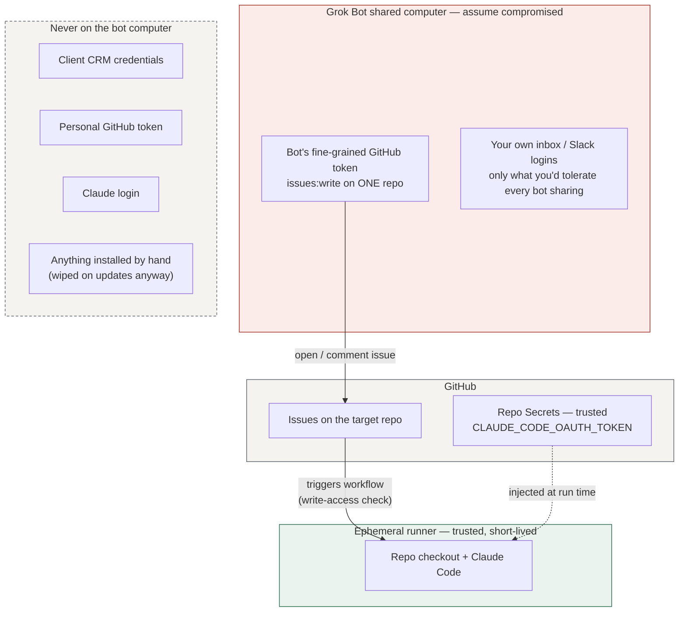

# 05 — Security

## What lives where

Grok Bot's documentation says plainly: all bots on an account share one computer, and separate bots must not be treated as a security boundary. Design for that. The only thing that computer needs to talk to GitHub is a token that can open issues on one repo.

## Threat model

| Threat | Path | Mitigation | Residual |
|---|---|---|---|
| **Prompt injection via issue/PR text** ("Comment and Control" class, CVSS 9.4 in 2026) | Stranger posts a crafted comment; Claude obeys; secrets leak | The action only runs for **write-access** accounts. Private repo. Fixed `allowed_tools` (no arbitrary network egress tools). Runner holds only the OAuth token, which is scoped to your subscription, not to production systems. | A write-access account being compromised. Keep the roster small, 2FA on all. |
| **Bot computer compromised** | Another bot on the shared VM is manipulated | The only credential there is the repo-scoped issues token. | Spam issues. Rotate the token. |
| **Runaway spend** | Loop with no stop condition | `--max-turns`, `timeout-minutes`, `concurrency`; Grok Bot on-demand limit `$0`; channel turn caps | A bad brief still costs one bounded run. |
| **Malicious PR merged** | Claude writes something harmful; you merge without reading | You are the gate. CI runs tests and scanners on every PR. | Read the diff. Small PRs. |
| **Token theft from GitHub Secrets** | Repo admin compromise, malicious workflow | Secrets are per-repo; the template pins the action to `@v1`; no third-party actions in the workflow. Fork PRs never receive secrets. | Same as any GitHub Actions setup. |
| **Data leaving your control** | Client data on the bot computer | Rule: client CRM data is never handled on the Grok Bot computer; research bots work on public data | Enforce with Auto Review rules and the channel charter. |

## Non-negotiable rules

1. **Untrusted text and real credentials never share a machine.** The bot computer reads the world; the runner holds the token. They never meet.
2. **Allow-lists, not block-lists.** Tools in the workflow are named. Trigger accounts are those with write access. Everything else is denied by default.
3. **One scoped token per bot per repo.** Issues:write, one repo, 90-day expiry.
4. **Every irreversible action asks you.** Merge on GitHub; Auto Review rules on Grok Bot for email, spend, post, production.
5. **Your subscriptions, your work.** Anthropic's terms do not permit routing other people's requests through your Claude plan. This template is used by each person with their own token. Don't wrap it in a shared service.

## What this does NOT protect against

- Grok Bot's own reliability (shared computer stuck states).
- A write-access collaborator going rogue.
- You merging without reading.
