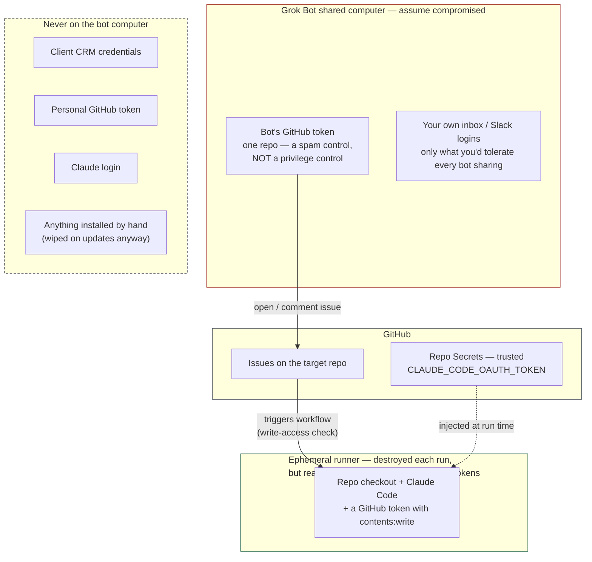

# 05 — Security

## What lives where

Grok Bot's documentation says plainly: all bots on an account share one computer, and separate bots must not be treated as a security boundary. Design for that. The only thing that computer needs to talk to GitHub is a token that can open issues on one repo.

## Threat model

| Threat | Path | Mitigation | Residual |
|---|---|---|---|
| **Prompt injection via issue/PR text** (the "Comment and Control" class — that 2026 disclosure named Anthropic's *Claude Code Security Review*, **not** the action this template uses, which does check the triggering actor's write access; see the note under this table) | Anyone who can comment on the thread plants instructions; Claude reads them on the next run | Private repo. Narrow tool allow-list. The action strips HTML comments, invisible characters, image alt text, hidden attributes and HTML entities — but the action's own security documentation says *"new bypass techniques may emerge"* and recommends reviewing raw content from external contributors before letting Claude process it (source and read-date in rule 3). On public repos, `include_comments_by_actor`. The template sets neither `allowed_bots` nor `allowed_non_write_users`, so the write-access check stays on (rule 3). | **Real and unsolved.** The write-access check does *not* help here: every comment on the thread reaches Claude regardless of who wrote it, so a **read-only** collaborator can plant text that fires when someone with write access says `@claude`. Read threads before invoking Claude on them. |
| **Bot computer compromised** | Another bot on the shared VM is manipulated | The token there reaches one repo only. | **Not just spam issues.** The action checks the *account's* write access, not the *token's* scope, so whoever holds that token can start a full Claude run with `contents: write` on a prompt they wrote. They cannot merge — that is still you. Rotate the token. |
| **Runaway spend** | Loop with no stop condition | `--max-turns`, `timeout-minutes`, `concurrency`; Grok Bot on-demand limit `$0`; turn caps in bot descriptions | A bad brief still costs one bounded run. There is no Grok Bot-specific spend cap, so the account-wide on-demand limit is the only brake on that side. |
| **Malicious PR merged** | Claude writes something harmful; you merge without reading | You are the gate. CI runs tests and scanners on every PR. | Read the diff. Small PRs. |
| **Token theft from GitHub Secrets** | Repo admin compromise, malicious workflow | Secrets are per-repo; no third-party actions in the workflow. **`@v1` is a mutable major tag, not a pin** — pin a commit SHA if you want supply-chain protection, and accept the upgrade burden. **Fork isolation is not what protects this workflow:** it triggers on `issue_comment` and the review events, which run in the *base* repo context *with* secrets, including on fork PRs. The real control is the write-access check on the triggering actor. | Same as any GitHub Actions setup, plus whatever a write-access account can reach. |
| **Data leaving your control** | Client data on the bot computer | Rule: client CRM data is never handled on the Grok Bot computer; research bots work on public data | Enforce with Auto Review rules and bot descriptions. Note an admin **cannot force Auto Review on** — *"An organization-level lock is not available"* — so this control depends on user cooperation. |

**Note on the "Comment and Control" disclosure, and why its severity score is not something we assert.**
It was published in 2026 against three separate agent integrations. The Anthropic one was
*Claude Code Security Review* — a different GitHub Action from `anthropics/claude-code-action`,
which is what `templates/claude.yml` uses and which does check the triggering actor's write
access. That distinction is the only part of this we depend on, and it holds.

The disposition matters as much as the headline, so here is all of it. Secondary reporting says
Anthropic rated the finding internally at CVSS 9.3, then 9.4, paid a $100 bounty on HackerOne
report 3387969, and — per one of the two sources below — **later downgraded the severity to
None**. No vendor published an advisory and no CVE was assigned for it, so there is no primary
record to check any of that against. **Treat the score as unverified**, and do not quote 9.4 on
its own: it is the high-water mark of a number that moved twice and then, by one account, went
away.

Both sources are secondary technical press, read 2026-09-07:
<https://cybersecuritynews.com/prompt-injection-via-github-comments/> (published 2026-04-21) and
<https://repello.ai/blog/comment-and-control-claude-code-gemini-copilot-prompt-injection>
(published 2026-05-07, and the one that reports the downgrade).

## Non-negotiable rules

1. **Untrusted text and real credentials never share a machine.** True of the Grok Bot computer. **Not true of the runner** — the runner reads the issue thread, which is untrusted text, while holding the Claude token *and* a GitHub token with `contents: write`. That is inherent to the design; the containment is that the runner is destroyed after each run and holds nothing from production.
2. **Allow-lists, not block-lists.** Tools in the workflow are named. Trigger accounts are those with write access. But note the limit: **running a repo's tests means executing that repo's code**, and on pull-request runs that code comes from the pull request. No allow-list avoids that. If you cannot accept it, drop the pull-request triggers and run issue-only.
3. **Never populate `allowed_bots` — or `allowed_non_write_users`.** Both switch off the same control everything else here rests on: the check that the account which triggered the run has write access to this repository. They do it in different ways, which is why both need naming. `templates/claude.yml` sets neither, and nothing built on it should.

   | Input | What it does to the write-access check | The vendor's own words |
   |---|---|---|
   | `allowed_bots` | Lets a matching bot actor through with **no permission check at all**. Adding one entry replaces the whole access control with that list. | *"Allowed bots are not checked for repository permissions. A bot that matches an entry does not need to be installed on your repository or have write access."* |
   | `allowed_non_write_users` | Grants the trigger to named accounts — or `*`, everyone — that **do not** have write access. | Headed *"Non-Write User Access (RISKY)"*. *"This is a significant security risk and should only be used for workflows with extremely limited permissions."* It *"bypasses the primary security mechanism of this action."* |

   Both quotations: <https://github.com/anthropics/claude-code-action/blob/main/docs/security.md>, read 2026-09-07 (`gh api repos/anthropics/claude-code-action/contents/docs/security.md`). The action rejects bot actors by default and both inputs are empty — leave them that way.

   Three further things from the same page, so you do not meet them for the first time while editing a workflow:

   - `allowed_non_write_users` **only works when you pass `github_token` as an input**, and `templates/claude.yml` deliberately does not pass one (D10 — leaving it unset is what makes the action authenticate as the Claude GitHub App). So in the template as shipped the input is inert. That is a happy accident of another decision, not a control. Do not rely on it.
   - If you ever do use it, the vendor says pass `${{ secrets.GITHUB_TOKEN }}` and **not** a personal access token, *"a static token does not rotate between runs and could be partially or fully recovered over time via prompt injection."*
   - On that path only, Claude does a best-effort scrub of secrets from subprocess environments, controlled by `CLAUDE_CODE_SUBPROCESS_ENV_SCRUB` (on by default, `0` opts out). It is documented for `allowed_non_write_users`, so it is **not** doing work in the threat table above — do not count it as a mitigation Handoff has.

   What this means in practice:

   | Actor | Outcome |
   |---|---|
   | A GitHub **User** account with write access — including a dedicated machine account (D5) | Runs. This is the supported path. |
   | A GitHub **App** — the likely shape of a native chat-bot connector | **Rejected outright.** No configuration on our side changes this except `allowed_bots`, which you should not use. |

   This is why the setup guide has you check `user.type` and `performed_via_github_app` after the first bot-opened issue, and why a login ending in `[bot]` is a stop-and-tell-me condition rather than something to work around. See D5, D5a and task 1.4.
4. **A fine-grained token on your own account**, `Issues: read and write`, scoped to the target repository, 90-day expiry. Treat it as a spam control, not a privilege control — see the threat table. Two things this rule used to say and should not have:

   - **No organisation is required.** D5a reversed that on 2026-09-05; the setup guide and README have started from a personally-owned repository ever since. An org-owned machine account is an attribution upgrade (D5) — it lets you see at a glance which issues a bot opened — not a prerequisite.
   - **You cannot scope a token to one bot.** Grok Bot connectors are account-wide: every bot on the account can use any permitted connector (quoted with its source in D5). "The Coder's token" is a convenient fiction; it is the account's token. Design for that instead of promising isolation that does not exist.
5. **Every irreversible action asks you.** Merge on GitHub; Auto Review rules on Grok Bot for email, spend, post, production.
6. **Your subscriptions, your work.** Each person runs this template with **their own** token, on **their own** repositories. Do not wrap it in a shared service that routes other people's requests through one Claude plan. **We have not quoted or linked Anthropic's terms here, so treat this as our operating rule rather than a statement of what the contract says** — if you are considering a shared deployment, read the terms yourself, or ask Anthropic.

## What this does NOT protect against

- Grok Bot's own reliability (shared computer stuck states).
- A write-access collaborator going rogue.
- **Prompt injection.** Reduced, not prevented. Anthropic's sanitisation is explicitly best-effort and they recommend reading raw untrusted input before letting Claude process it.
- **Anyone who can comment on a thread you later invoke Claude on** — including read-only collaborators.
- **Changes you make to the action's inputs.** Two of them — `allowed_bots` and `allowed_non_write_users` — switch off the write-access check that everything above rests on. Read rule 3 before adding either.
- You merging without reading.
