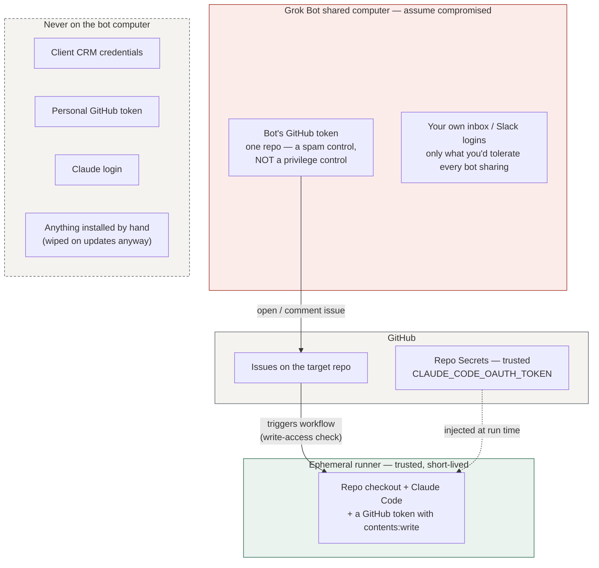

# 05 — Security

## What lives where

Grok Bot's documentation says plainly: all bots on an account share one computer, and separate bots must not be treated as a security boundary. Design for that. The only thing that computer needs to talk to GitHub is a token that can open issues on one repo.

## Threat model

| Threat | Path | Mitigation | Residual |
|---|---|---|---|
| **Prompt injection via issue/PR text** (the "Comment and Control" class; the CVSS 9.4 disclosure in 2026 named Anthropic's *Claude Code Security Review*, **not** this action, which does have an actor check) | Anyone who can comment on the thread plants instructions; Claude reads them on the next run | Private repo. Narrow tool allow-list. The action strips HTML comments, invisible characters and hidden attributes — **imperfectly, by Anthropic's own admission**. On public repos, `include_comments_by_actor`. | **Real and unsolved.** The write-access check does *not* help here: every comment on the thread reaches Claude regardless of who wrote it, so a **read-only** collaborator can plant text that fires when someone with write access says `@claude`. Read threads before invoking Claude on them. |
| **Bot computer compromised** | Another bot on the shared VM is manipulated | The token there reaches one repo only. | **Not just spam issues.** The action checks the *account's* write access, not the *token's* scope, so whoever holds that token can start a full Claude run with `contents: write` on a prompt they wrote. They cannot merge — that is still you. Rotate the token. |
| **Runaway spend** | Loop with no stop condition | `--max-turns`, `timeout-minutes`, `concurrency`; Grok Bot on-demand limit `$0`; channel turn caps | A bad brief still costs one bounded run. |
| **Malicious PR merged** | Claude writes something harmful; you merge without reading | You are the gate. CI runs tests and scanners on every PR. | Read the diff. Small PRs. |
| **Token theft from GitHub Secrets** | Repo admin compromise, malicious workflow | Secrets are per-repo; no third-party actions in the workflow. **`@v1` is a mutable major tag, not a pin** — pin a commit SHA if you want supply-chain protection, and accept the upgrade burden. **Fork isolation is not what protects this workflow:** it triggers on `issue_comment` and the review events, which run in the *base* repo context *with* secrets, including on fork PRs. The real control is the write-access check on the triggering actor. | Same as any GitHub Actions setup, plus whatever a write-access account can reach. |
| **Data leaving your control** | Client data on the bot computer | Rule: client CRM data is never handled on the Grok Bot computer; research bots work on public data | Enforce with Auto Review rules and the channel charter. |

## Non-negotiable rules

1. **Untrusted text and real credentials never share a machine.** True of the Grok Bot computer. **Not true of the runner** — the runner reads the issue thread, which is untrusted text, while holding the Claude token *and* a GitHub token with `contents: write`. That is inherent to the design; the containment is that the runner is destroyed after each run and holds nothing from production.
2. **Allow-lists, not block-lists.** Tools in the workflow are named. Trigger accounts are those with write access. But note the limit: **running a repo's tests means executing that repo's code**, and on pull-request runs that code comes from the pull request. No allow-list avoids that. If you cannot accept it, drop the pull-request triggers and run issue-only.
3. **One token per bot per repo**, org-owned, 90-day expiry. Treat it as a spam control, not a privilege control — see the threat table.
4. **Every irreversible action asks you.** Merge on GitHub; Auto Review rules on Grok Bot for email, spend, post, production.
5. **Your subscriptions, your work.** Anthropic's terms do not permit routing other people's requests through your Claude plan. This template is used by each person with their own token. Don't wrap it in a shared service.

## What this does NOT protect against

- Grok Bot's own reliability (shared computer stuck states).
- A write-access collaborator going rogue.
- **Prompt injection.** Reduced, not prevented. Anthropic's sanitisation is explicitly best-effort and they recommend reading raw untrusted input before letting Claude process it.
- **Anyone who can comment on a thread you later invoke Claude on** — including read-only collaborators.
- You merging without reading.
