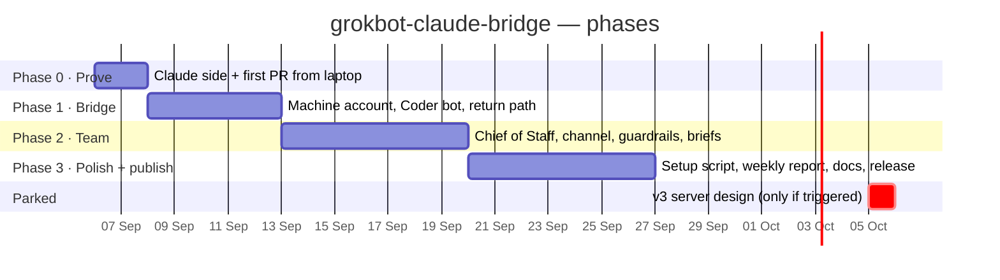

# 06 — Roadmap

## Phase 0 — Prove the thesis (weekend)

Goal: a PR billed to Claude Max, triggered by an issue, with no Grok Bot involved.

**Acceptance:** PR opened by the Claude app; zero API spend in Anthropic Console; your Claude usage shows the run.

**Kill criterion:** the OAuth path won't work on your account after two attempts and the upstream issue has no fix. Then the project's economics change — pause and reassess (API billing may still beat Grok Bot overage, but measure it).

## Phase 1 — The bridge (week 1)

Goal: a Grok Bot Coder can open the issue; the Chief of Staff hears about the PR.

**Acceptance:**
- Issue authored by the machine account → action runs → PR → routine reports in channel.
- Grok Bot meter moves by a handful of turns per task.
- Coder has never edited a file (check its computer's `/workspace`).

## Phase 2 — The team (week 2)

Goal: you talk only to the Chief of Staff.

**Acceptance:**
- Two-step task with no routing hints is researched, delegated, reported once.
- Auto Review stops an email/spend/post/production action and asks you.
- Weekly Grok Bot allowance under 50% by Wednesday on coordination-only work.
- Five real tasks merged. Rejection rate under 30%.

## Phase 3 — Polish and publish (week 3)

Goal: someone else can set this up from the README in under two hours.

**Acceptance:**
- `scripts/setup.sh` does Step 1 of the setup guide end to end.
- A weekly scheduled run posts cost-per-merged-PR as an issue comment.
- A stranger (or a fresh Claude Code session with only the README) completes setup on a new repo.
- Tagged `v1.0.0`, MIT licence, `CONTRIBUTING.md`.

## What would make us add a server (the parked v3 design)

Only these triggers. Not "it would be nice."

| Trigger | What comes back |
|---|---|
| Tasks need memory across runs (multi-day features, a crew) | firstmate on a VPS; Claude Code Channels for push-in; permission relay |
| Tasks touch private infrastructure the hosted runner can't reach | self-hosted runner on a VPS behind Tailscale |
| A client wants the whole stack self-hosted | Gitea + Woodpecker, two-node brain/hands split, OTel + Grafana |
| Grok Bot ships a model picker, published allowances and a spend cap | possibly *less* — reconsider whether the bridge is needed at all |

The full v3 design (two Hetzner nodes, gateway, channels, relay, the eleven-gap scoreboard) is preserved as the answer to those triggers. It is not the plan.

## Ideas backlog (unscheduled)

- Second workflow in **agent mode** for scheduled maintenance ("every Monday: update dependencies, run tests, open PR").
- Discord as a second inbox via the official Claude Code Discord channel — a fallback if Grok Bot is down.
- Cross-model review: a read-only Grok review step on Claude's PRs, for a second opinion from a model with different blind spots.
- Cost report as a GitHub Pages dashboard, no server.
- A `bridge doctor` script that checks: secret present, workflow on default branch, machine account has write, token not expired.
